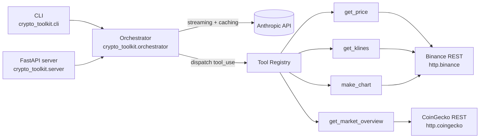

# claude-crypto-toolkit

> A reference implementation of Anthropic Claude's advanced API patterns —
> Tool Use, Prompt Caching, Streaming, and Scope Enforcement —
> using public crypto market data (Binance, CoinGecko).

## What this demonstrates

- **Tool Use orchestration** — multi-round loop with 4 production tools
- **Streaming with interleaved tool calls** — text + tool execution events
- **Prompt caching** — system prompt and tool definitions cached, measured cost reduction
- **Strict scope enforcement** — model refuses trading advice and price prediction

## Quickstart

```bash
git clone https://github.com/juitindev/claude-crypto-toolkit.git
cd claude-crypto-toolkit

python -m venv .venv
. .venv/Scripts/activate          # Windows PowerShell: .venv\Scripts\Activate.ps1
# . .venv/bin/activate            # macOS / Linux
pip install -e ".[dev]"

cp .env.example .env
# edit .env and paste your real ANTHROPIC_API_KEY

crypto-toolkit chat
```

One-shot:

```bash
crypto-toolkit ask "What is the current price of BTCUSDT?"
```

Caching benchmark:

```bash
crypto-toolkit benchmark-caching
```

FastAPI server:

```bash
uvicorn crypto_toolkit.server:app --reload
# POST http://127.0.0.1:8000/chat
```

## Architecture



## The four patterns, explained

### Tool Use

The orchestrator drives the canonical `messages.stream` → `tool_use` → execute → `tool_result` → loop until `stop_reason == end_turn`. Each tool implements a thin `Tool` subclass with `name`, `description`, `input_schema`, and `execute()`, registered in a single dict the orchestrator dispatches against. Errors raised inside `execute()` flow back to Claude as `is_error=True` tool results so the model can recover instead of crashing the turn. A configurable round ceiling (default 8) guarantees the loop terminates.

File reference: [`src/crypto_toolkit/orchestrator.py`](src/crypto_toolkit/orchestrator.py)

### Streaming

Every model turn uses `client.messages.stream(...)` and forwards `text_stream` chunks to caller-provided event hooks in real time, while still parsing the final assembled message to discover any `tool_use` blocks. Events are typed dataclasses (`TextDelta`, `ToolUseStart`, `ToolUseResult`, `Done`, `Error`) so both the CLI and the FastAPI/SSE layer can render them identically. The FastAPI endpoint wraps the same emitter in a background thread and pushes each event to the wire as a Server-Sent Event.

File reference: [`src/crypto_toolkit/streaming.py`](src/crypto_toolkit/streaming.py)

### Prompt Caching

Two ephemeral cache breakpoints are placed on every request: one on the system prompt block, one on the last tool definition (which extends the cache up to and including the full tool array). On the second turn with an unchanged system prompt and tool list, Anthropic serves both from cache: `cache_creation_input_tokens` drops to zero and `cache_read_input_tokens` carries the bulk of the prefix tokens. `crypto-toolkit benchmark-caching` runs the same 3-turn conversation twice and prints the resulting usage counters side by side.

File reference: [`src/crypto_toolkit/caching.py`](src/crypto_toolkit/caching.py)

Benchmark (run `crypto-toolkit benchmark-caching` to fill in real numbers):

| Run | cache_creation_input_tokens | cache_read_input_tokens | Saved % |
|-----|------------------------------|--------------------------|---------|
| 1   | _XXXX_ (first call writes the cache)  | 0      | -       |
| 2   | 0                                     | _XXXX_ | _~YY%_  |

### Scope Enforcement

The system prompt is the production refusal layer: it tells the model to reject trading advice, price predictions, and any off-topic request with fixed responses. No code-level filter blocks user input; the contract is purely prompt-level, which mirrors how production assistants are usually constrained. To prove this works in practice, the test suite includes a second, independent classifier prompt that labels messages `IN_SCOPE` / `OUT_OF_SCOPE`; the scope tests assert the classifier's verdicts on five known-bad and known-good inputs against the real API.

File reference: [`src/crypto_toolkit/prompts.py`](src/crypto_toolkit/prompts.py), [`src/crypto_toolkit/scope.py`](src/crypto_toolkit/scope.py)

## Tools

| Name | Description | Source |
|------|-------------|--------|
| `get_price` | Current spot price | Binance |
| `get_klines` | OHLCV candles | Binance |
| `get_market_overview` | Top 10 by market cap | CoinGecko |
| `make_chart` | Candlestick PNG (base64) | matplotlib |

## Project layout

```
claude-crypto-toolkit/
├── src/crypto_toolkit/
│   ├── cli.py                  # Typer CLI (chat / ask / benchmark-caching)
│   ├── server.py               # FastAPI SSE endpoint
│   ├── orchestrator.py         # tool-use + streaming loop
│   ├── streaming.py            # typed event dataclasses
│   ├── caching.py              # cache_control helpers + usage parser
│   ├── prompts.py              # SYSTEM_PROMPT + scope classifier prompt
│   ├── scope.py                # test-only classifier (assert_in_scope)
│   ├── settings.py             # pydantic Settings from env
│   ├── client_factory.py       # Anthropic() singleton
│   ├── tools/                  # 4 tools + registry + base class
│   └── http/                   # Binance + CoinGecko REST clients
├── examples/                   # runnable demo scripts
└── tests/                      # respx-mocked unit tests + live scope tests
```

## Testing

```bash
pytest                          # offline tests only (HTTP + Anthropic both mocked)
pytest -m live                  # also run the 5 real-API scope tests
ruff check . && ruff format --check . && mypy src/
```

Live tests are skipped automatically unless `ANTHROPIC_API_KEY` is set to a real key.

## Non-goals

This is a *patterns* demo. It is deliberately not:

- A trading bot (no order placement, no private API keys)
- An investment-advice product (the model refuses it)
- An MCP server (separate future project)
- Multi-LLM (Anthropic only)

## License

[MIT](LICENSE)
